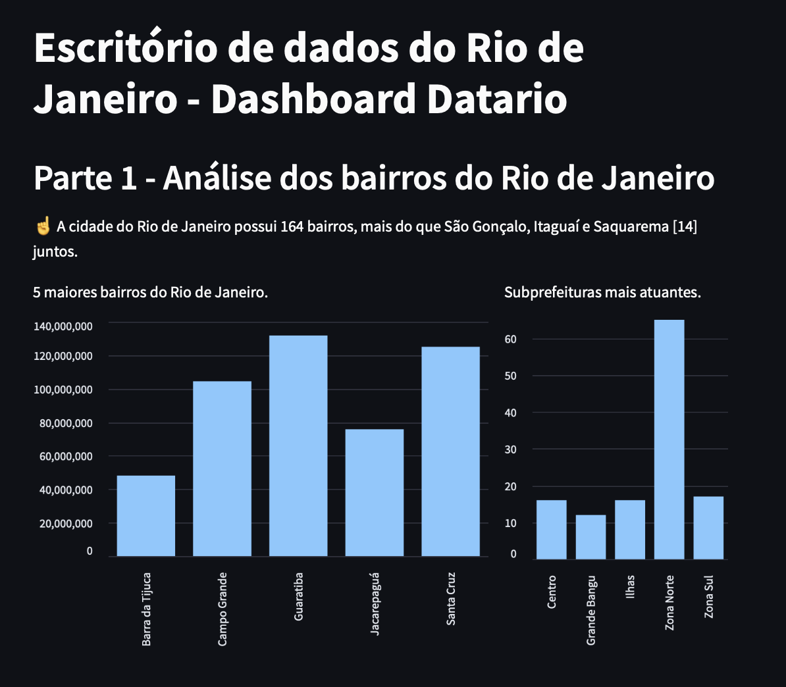
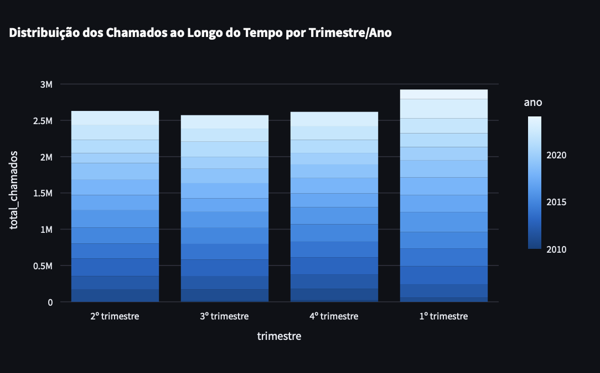
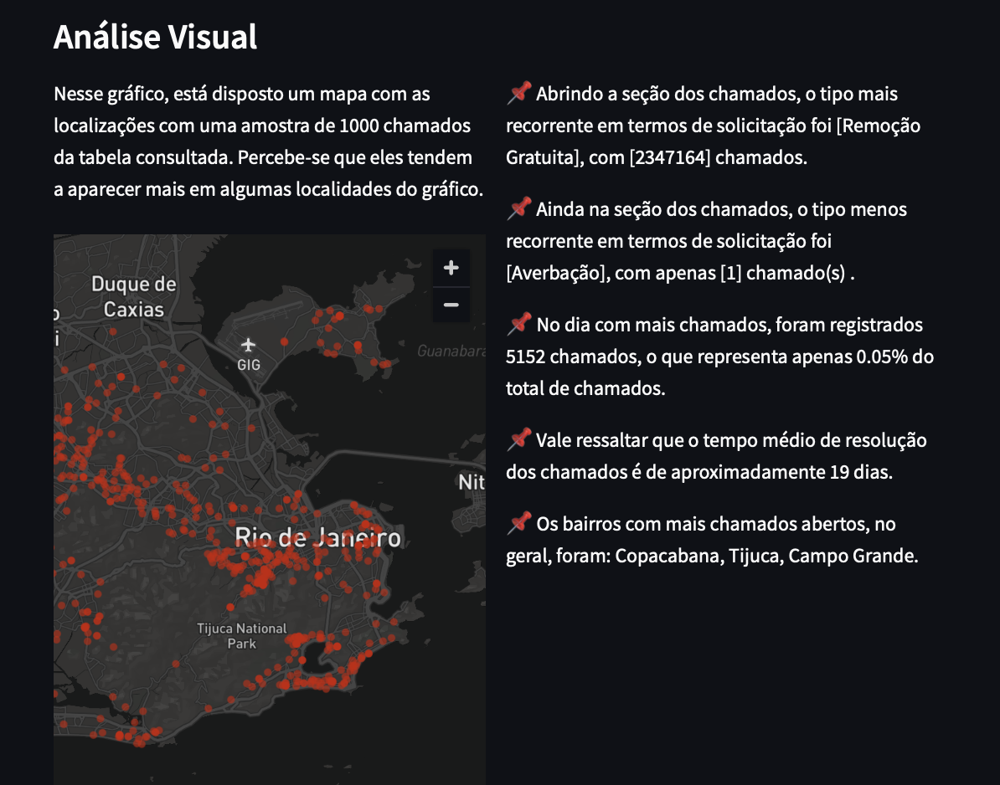

# Dashboards: informações e tutoriais

### Objetivo

 Nessa branch, você encontrará somente a visualização dos dados em forma de dados. Na branch `main` estão as respostas às perguntas do desafio. Para a visualização dos dados, criei uma aplicação local usando Streamlit.

O que cada arquivo contém:
> `dashboard.py`: análise completa dos dados, em um dashboard com descrições e explicações complementares;
> `PowerBI_escr_dados.pbix`: análise mais simples, em gráficos, baseadas em algumas consultas feitas na tabela, sem descrições ou explicações complementares.

Os dois dashboards são interativos.

### Perguntas do Desafio

As perguntas do desafio estão detalhadas no arquivo `perguntas_desafio.md`. As respostas das perguntas estão na branch `main` e a visualização dos dados extraídos está nesta branch.

## Etapas - Streamlit

1. Siga o tutorial (disponível no readme da branch main) para criar sua conta no GCP e aprender como utilizar o BigQuery para consultar os dados. Você precisa ter um id válido de projeto para conseguir fazer as consultas do arquivo `querys.py`.
2. Com o Google Cloud Studio e BigQuery já configurados, é possível fazer as consultas disponíveis nos arquivos para construir a visualização dos dados (`querys.py`, **alterando somente o id do projeto no início dos arquivos**). A consulta só funcionará mediante a prévia configuração nas plataformas mencionadas e autenticação de conta.
3. Tenha certeza de que todos os pacotes listados em `requirements.txt` estão instalados e configurados propriamente nas variáveis do sistema. Para facilitar o processo, você pode criar e ativar o ambiente virtual e rodar o comando `pip install -r requirements.txt`, baixando tudo que é necessário de uma só vez.
4. Pronto. Agora podemos visualizar o dashboard. No terminal, dentro da pasta `Dashboard`, rode o comando `streamlit run dashboard.py` para visualizar os gráficos e explicações (ou acesse o arquivo `PowerBI_escr_dados.pbix` dentro do PowerBI Desktop para ver alguns outros gráficos de análise).
5. Uma aplicação web aparecerá e irá carregar à medida que as consultas vão sendo feitas para construir as tabelas e gráficos.

## Possíveis problemas
- O comando `streamlit run arquivo.py` pode retornar um erro de path. Isso significa que o seu pacote provavelmente não está configurado nas variáveis do sistema. Caso isso ocorra, basta digitar 
`export PATH="/Users/seu_usuario/Library/Python/3.9/bin:$PATH`
no seu terminal, alterando `seu_usuario` pelo seu user. Depois disso, `streamlit run` funcionará normalmente.

- Se as querys não estiverem funcionando corretamente, certifique-se de **alterar o id da variável `project_id` pelo id do seu projeto criado na conta do Google Cloud no arquivo `Dashboard/funcoes`**. Esse é o único dado que precisa ser alterado para que elas funcionem.

## Contribuições
Para contribuir, sinta-se livre para criar issues no projeto e/ou entrar em contato.

## Algumas análises retiradas da aplicação Streamlit

## Autoria
Por Milena Maia
 
email: maiaaraujo.milena@gmail.com
